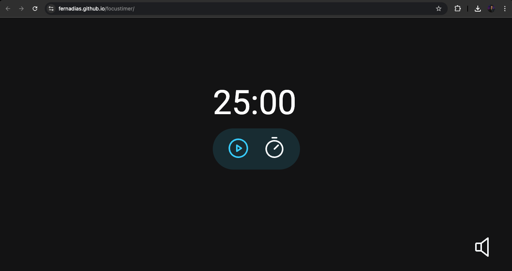

<h1 align="center">
	Focus Timer
</h1>

<h3 align="center">
	Project created for focus based on Pomodoro
</h3>

  

## About
In this project, I learned and practiced JavaScript, HTML, and CSS. A timer based on the Pomodoro Method was created. We developed it in the Explorer course at RocketSeat with teacher Mayk Brito.

## Tech Stack
&nbsp;
&nbsp;
&nbsp;

## Usage
To use this project:

[Link Project](https://fernadias.github.io/focustimer/)

## Contact

Made with ❤️ by [Igor Silva](https://github.com/fernadias), get in touch!

&nbsp;
&nbsp;

 